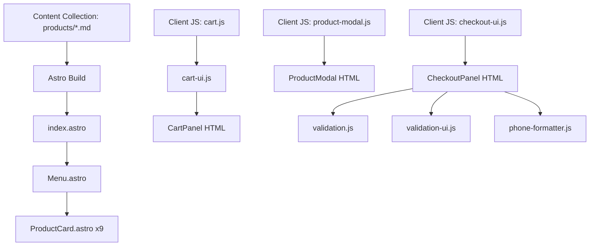

# Astro Migration Roadmap

**Document Type:** 15,000ft (Iterate)
**Part of:** [Coding with V.I.B.E.S.](../coding_with_vibes/README.md)
**Status:** Complete
**Last Updated:** 2026-02-01

## Purpose

This document provides the architectural blueprint and step-by-step migration plan for transforming the All Day Treats website from a monolithic Vite-based structure to a component-based Astro architecture. It bridges the vision (why migrate) with execution (how to migrate).

## Architecture Overview

### Current Architecture (Vite + Vanilla JS)

```
alldaytreats/
├── index.html              # Monolithic HTML (638 lines)
├── src/
│   ├── main.js            # App initialization
│   ├── products.js        # Product data export
│   ├── cart.js            # Cart state management
│   ├── cart-ui.js         # Cart UI logic
│   ├── checkout-ui.js     # Checkout form logic
│   ├── product-modal.js   # Modal interactions
│   ├── validation.js      # Form validation
│   ├── validation-ui.js   # Validation UI
│   ├── phone-formatter.js # Phone formatting
│   ├── style.css          # Main CSS entry
│   ├── styles/            # Feature CSS files
│   └── images/            # Product images
└── public/
```

**Pain Points:**
- All content in single HTML file
- Products hardcoded in both HTML and JS
- Templates mixed with page structure
- No clear component boundaries

### Target Architecture (Astro + Vanilla JS)

```
alldaytreats/
├── src/
│   ├── assets/
│   │   └── images/           # Optimized images (Astro handles)
│   ├── components/           # Focused Astro components
│   │   ├── Header.astro
│   │   ├── Hero.astro
│   │   ├── Menu.astro
│   │   ├── ProductCard.astro
│   │   ├── Footer.astro
│   │   ├── CartPanel.astro
│   │   ├── ProductModal.astro
│   │   └── CheckoutPanel.astro
│   ├── content/
│   │   ├── config.ts         # Zod schema for products
│   │   └── products/         # Markdown files (one per product)
│   ├── layouts/
│   │   └── Layout.astro      # Base page wrapper
│   ├── pages/
│   │   └── index.astro       # Homepage composition
│   ├── scripts/              # Client-side JS (unchanged logic)
│   │   ├── cart.js
│   │   ├── cart-ui.js
│   │   ├── checkout-ui.js
│   │   ├── product-modal.js
│   │   ├── validation.js
│   │   ├── validation-ui.js
│   │   └── phone-formatter.js
│   └── styles/               # Global CSS (unchanged)
│       ├── variables.css
│       ├── base.css
│       └── ...
└── public/
    └── favicon.svg
```

**Benefits:**
- Clear component boundaries
- Products as data (content collection)
- Self-documenting structure
- Surgical change capability
- Type-safe product schema

## Component Architecture

### Component Breakdown

Each component has a single, focused responsibility:

#### 1. Layout Components

**`Layout.astro`**
- **Purpose:** Base HTML structure, meta tags, global styles
- **Responsibilities:** `<html>`, `<head>`, `<body>` wrapper
- **Imports:** Global CSS files
- **Outputs:** Full page skeleton

**`Header.astro`**
- **Purpose:** Site header with branding and cart button
- **Responsibilities:** Logo, contact links, cart badge
- **Props:** Cart item count (from page data)
- **Outputs:** `<header>` element

**`Footer.astro`**
- **Purpose:** Site footer with contact and order info
- **Responsibilities:** Contact links, order policies, copyright
- **Props:** None
- **Outputs:** `<footer>` element

#### 2. Content Components

**`Hero.astro`**
- **Purpose:** Hero section with branding and CTA
- **Responsibilities:** Logo, tagline, "View Menu" button
- **Props:** None
- **Outputs:** `<section class="hero">`

**`Menu.astro`**
- **Purpose:** Product grid with category filtering
- **Responsibilities:** Tab filters, product grid composition
- **Props:** Products array (from content collection)
- **Outputs:** `<section class="menu">`

**`ProductCard.astro`**
- **Purpose:** Individual product display card
- **Responsibilities:** Image, title, description, price
- **Props:** Product data (from content entry)
- **Outputs:** `<article class="menu__item">`

#### 3. Interactive Overlays

**`CartPanel.astro`**
- **Purpose:** Shopping cart overlay (replaces template)
- **Responsibilities:** Render cart structure for JS hydration
- **Props:** None (managed by client JS)
- **Outputs:** `<div class="cart">` structure

**`ProductModal.astro`**
- **Purpose:** Product details modal (replaces template)
- **Responsibilities:** Render modal structure for JS hydration
- **Props:** None (managed by client JS)
- **Outputs:** `<dialog class="product-modal">` structure

**`CheckoutPanel.astro`**
- **Purpose:** Checkout form overlay (replaces template)
- **Responsibilities:** Render checkout structure for JS hydration
- **Props:** None (managed by client JS)
- **Outputs:** `<div class="checkout">` structure

### Data Flow



**Build Time:**
1. Astro reads product markdown files
2. Validates against Zod schema
3. Passes to `Menu.astro` component
4. `Menu.astro` renders `ProductCard.astro` for each
5. Static HTML generated

**Runtime:**
1. User clicks product → `product-modal.js` shows modal
2. User adds to cart → `cart.js` updates state
3. Cart badge updates → `cart-ui.js` handles UI
4. User checks out → `checkout-ui.js` manages form
5. Validation runs → `validation.js` + `validation-ui.js`

## Content Collection Schema

Products are defined with the following Zod schema:

```typescript
// src/content/config.ts
import { defineCollection, z } from 'astro:content';

const products = defineCollection({
  type: 'content',
  schema: ({ image }) => z.object({
    id: z.string(),
    name: z.string(),
    category: z.enum(['candy', 'chocolate', 'platter']),
    image: image(),
    priceFrom: z.number().positive(),
    priceOptions: z.array(z.object({
      count: z.number().positive(),
      price: z.number().positive(),
    })),
    extraAddOns: z.number().default(5),
    order: z.number().default(999),
  }),
});

export const collections = { products };
```

**Product Markdown Example:**

```markdown
---
id: candy-grapes
name: Candy Grapes
category: candy
image: ../../assets/images/candy-grapes-new.jpg
priceFrom: 10
priceOptions:
  - count: 6
    price: 10
  - count: 8
    price: 15
  - count: 12
    price: 20
extraAddOns: 5
order: 1
---

Fresh grapes coated in a sweet candy shell with colorful sprinkles
```

## Migration Strategy

### Phase 1: Foundation Setup ✅

**Goal:** Establish Astro project structure

**Tasks:**
1. ✅ Create Astro project in `all-day-treats/` folder
2. ✅ Configure `astro.config.mjs` (default settings)
3. ✅ Set up package.json with Astro scripts
4. ⬜ Create directory structure
5. ⬜ Create placeholder components

**Completion Criteria:**
- `npm run dev` starts Astro dev server
- Directory structure matches target architecture
- All components exist (even if empty)

### Phase 2: Content Collection Migration

**Goal:** Move products from JS to markdown

**Tasks:**
1. ⬜ Create `src/content/config.ts` with Zod schema
2. ⬜ Create `src/content/products/` directory
3. ⬜ Convert each product to markdown file (9 files)
4. ⬜ Copy images to `src/assets/images/`
5. ⬜ Test content collection loads without errors

**Completion Criteria:**
- All 9 products converted to markdown
- Schema validation passes
- Images imported correctly
- `getCollection('products')` returns all products

**Files to Create:**
- `candy-grapes.md`
- `candy-strawberries.md`
- `candy-pineapple-rings.md`
- `chocolate-strawberries.md`
- `cake-pops.md`
- `chocolate-oreos.md`
- `chocolate-pretzels.md`
- `chocolate-rice-krispies.md`
- `party-platter.md`

### Phase 3: Layout & Style Migration

**Goal:** Establish base layout and styles

**Tasks:**
1. ⬜ Create `Layout.astro` with HTML structure
2. ⬜ Copy all CSS files to `src/styles/`
3. ⬜ Import CSS in Layout component
4. ⬜ Update CSS paths for Astro structure
5. ⬜ Test styles load correctly

**Completion Criteria:**
- Layout renders with correct meta tags
- All styles load without 404 errors
- CSS custom properties work
- No style regressions

### Phase 4: Static Components

**Goal:** Build non-interactive components

**Tasks:**
1. ⬜ Create `Header.astro` component
2. ⬜ Create `Hero.astro` component
3. ⬜ Create `Footer.astro` component
4. ⬜ Create `ProductCard.astro` component
5. ⬜ Create `Menu.astro` component
6. ⬜ Wire components together in `index.astro`

**Completion Criteria:**
- Header displays with correct content
- Hero section matches original
- Footer renders with all links
- Product cards display from content collection
- Visual parity with original site (static parts)

**Component Implementation Order:**
1. Header (simplest, establishes pattern)
2. Hero (static content)
3. Footer (static content)
4. ProductCard (uses content collection)
5. Menu (composes ProductCard components)

### Phase 5: Interactive Components

**Goal:** Migrate overlay components and templates

**Tasks:**
1. ⬜ Create `CartPanel.astro` from template HTML
2. ⬜ Create `ProductModal.astro` from template HTML
3. ⬜ Create `CheckoutPanel.astro` from template HTML
4. ⬜ Add components to `index.astro`
5. ⬜ Test components render correct structure

**Completion Criteria:**
- Cart panel HTML matches original template
- Product modal HTML matches original template
- Checkout panel HTML matches original template
- All elements have correct IDs and classes for JS

### Phase 6: JavaScript Migration

**Goal:** Wire up client-side interactivity

**Tasks:**
1. ⬜ Copy all JS files to `src/scripts/`
2. ⬜ Update import paths for Astro structure
3. ⬜ Add `<script>` tags to `index.astro`
4. ⬜ Update product data access (use products from collection)
5. ⬜ Test all interactive features

**Completion Criteria:**
- Menu filtering works
- Product modals open on click
- Cart add/remove works
- Cart badge updates
- Checkout form validates
- Phone formatting works
- Email submission works

**Files to Migrate:**
- `cart.js`
- `cart-ui.js`
- `checkout-ui.js`
- `product-modal.js`
- `validation.js`
- `validation-ui.js`
- `phone-formatter.js`

**Key Changes:**
- Update `products` import to use Astro data
- Ensure DOM selectors match new component structure
- Test event listeners attach correctly

### Phase 7: Testing & Validation

**Goal:** Ensure complete functional parity

**Testing Checklist:**

**Visual Regression:**
- [ ] Header matches original
- [ ] Hero section matches original
- [ ] Menu grid matches original
- [ ] Product cards match original
- [ ] Footer matches original
- [ ] Cart panel matches original
- [ ] Product modal matches original
- [ ] Checkout form matches original
- [ ] Responsive behavior identical
- [ ] Animations work (View Transitions)

**Functional Testing:**
- [ ] Menu tabs filter products
- [ ] Clicking product opens modal
- [ ] Modal shows correct product info
- [ ] Quantity selection works
- [ ] Special instructions text area works
- [ ] Add to cart updates badge
- [ ] Cart button opens cart panel
- [ ] Cart displays items correctly
- [ ] Cart quantity adjustment works
- [ ] Cart item removal works
- [ ] Cart total calculates correctly
- [ ] Clear cart works
- [ ] Proceed to checkout works
- [ ] Checkout form fields validate
- [ ] Phone number formats correctly
- [ ] Required field validation works
- [ ] Email validation works
- [ ] Address validation works
- [ ] Form submission creates mailto link
- [ ] Success state shows
- [ ] Error handling works

**Performance Testing:**
- [ ] Lighthouse score ≥ 95
- [ ] First Contentful Paint < 1.5s
- [ ] Time to Interactive < 2.0s
- [ ] Images lazy load
- [ ] Images optimized (WebP)

**Browser Testing:**
- [ ] Chrome (latest)
- [ ] Firefox (latest)
- [ ] Safari (latest)
- [ ] Mobile Safari (iOS)
- [ ] Chrome Mobile (Android)

### Phase 8: Documentation & Cleanup

**Goal:** Finalize migration and clean up

**Tasks:**
1. ⬜ Update README with Astro instructions
2. ⬜ Document product addition process
3. ⬜ Create migration summary document
4. ⬜ Remove old Vite project files (after verification)
5. ⬜ Update deployment instructions

**Completion Criteria:**
- README accurate for Astro project
- Product addition documented
- Migration decisions recorded
- Old project archived (if needed)
- Ready for deployment

## Implementation Guidelines

### Component Development

**Pattern to Follow:**

```astro
---
// Component script (runs at build time)
import { getCollection } from 'astro:content';

interface Props {
  // Define props interface
}

const { propName } = Astro.props;

// Fetch data if needed
const items = await getCollection('products');
---

<!-- Component template -->
<element class="component">
  {items.map(item => (
    <div>{item.data.name}</div>
  ))}
</element>

<style>
  /* Only if component-specific styles needed */
  /* Otherwise use global CSS */
</style>

<script>
  // Only for client-side interactivity
  // Keep in src/scripts/ instead
</script>
```

**Rules:**
1. **Keep components simple** - One responsibility each
2. **Use TypeScript interfaces** - Define Props explicitly
3. **Leverage global styles** - No scoped styles unless necessary
4. **Client JS in scripts/** - Keep separate from components
5. **No barrel files** - Explicit imports only

### JavaScript Migration Rules

**DO:**
- ✅ Copy JS files as-is (preserve logic)
- ✅ Update import paths only
- ✅ Keep vanilla JS approach
- ✅ Test thoroughly after each file

**DON'T:**
- ❌ Rewrite logic "while we're here"
- ❌ Add frameworks or libraries
- ❌ Change behavior or structure
- ❌ Combine files unnecessarily

### CSS Migration Rules

**DO:**
- ✅ Keep all CSS files separate
- ✅ Maintain current organization
- ✅ Use global imports in Layout
- ✅ Preserve custom properties

**DON'T:**
- ❌ Convert to scoped styles
- ❌ Refactor CSS structure
- ❌ Change naming conventions
- ❌ Add CSS-in-JS

## Risk Management

### High-Risk Areas

**1. JavaScript State Management**
- **Risk:** Cart state breaks during migration
- **Mitigation:** Test cart operations after each change
- **Rollback Plan:** Keep original JS files until verified

**2. Form Validation**
- **Risk:** Validation stops working
- **Mitigation:** Test all validation scenarios
- **Rollback Plan:** Validation logic stays identical

**3. Image Paths**
- **Risk:** Images don't load after migration
- **Mitigation:** Test each image import
- **Rollback Plan:** Use public folder if Astro Image fails

### Testing Strategy

**Per-Phase Testing:**
- Test after each phase before moving to next
- Don't accumulate changes without verification
- Keep original site running for comparison

**Regression Testing:**
- Compare side-by-side with original
- Test all user flows completely
- Verify on mobile devices

**Performance Testing:**
- Run Lighthouse before and after
- Measure load times
- Check network waterfall

## Success Metrics

### Technical Metrics

- [ ] 100% functional parity
- [ ] 100% visual parity
- [ ] Lighthouse score ≥ 95
- [ ] Load time ≤ original
- [ ] Zero console errors
- [ ] Zero broken links
- [ ] Zero 404s

### Structural Metrics

- [ ] 9 markdown product files created
- [ ] 8 focused Astro components
- [ ] Clear file organization
- [ ] Self-documenting structure
- [ ] Type-safe content schema

### Developer Experience Metrics

- [ ] New product adds in < 5 min
- [ ] Component changes are isolated
- [ ] Clear mental model
- [ ] Easy to locate features
- [ ] AI can make surgical changes

## Rollback Plan

If critical issues arise:

1. **Keep original site deployed** until migration verified
2. **Version control** allows instant rollback
3. **Feature flags** for progressive rollout (if needed)
4. **Comparison environment** to test side-by-side

## Post-Migration Enhancements

Once migration complete and verified, consider:

1. **Type Generation** - Generate TypeScript types from content
2. **Build Validation** - Add broken link detection
3. **Image Optimization** - Fine-tune Astro Image settings
4. **Accessibility Audit** - Run full a11y testing
5. **Performance Optimization** - Optimize bundle size

## Related Documentation

### Vision (30,000ft)
- [Migration Vision](../vision/Migration_Vision.md) - Why we're migrating

### Standards
- [Coding with VIBES](../../docs/coding_with_vibes/README.md) - Development methodology
- [15,000ft Guidelines](../../docs/coding_with_vibes/15k_documentation_guidelines.md)

### Original Site
- [Original PRD](../../../PRD.md) - Product requirements
- [Original README](../../../README.md) - Current documentation

---

## Version History

| Date | Version | Changes |
|------|---------|---------|
| 2026-01-18 | 1.0 | Initial migration roadmap |

---

*This document provides the "how" of the Astro migration. For the "why," see [Migration Vision](../vision/Migration_Vision.md).*
