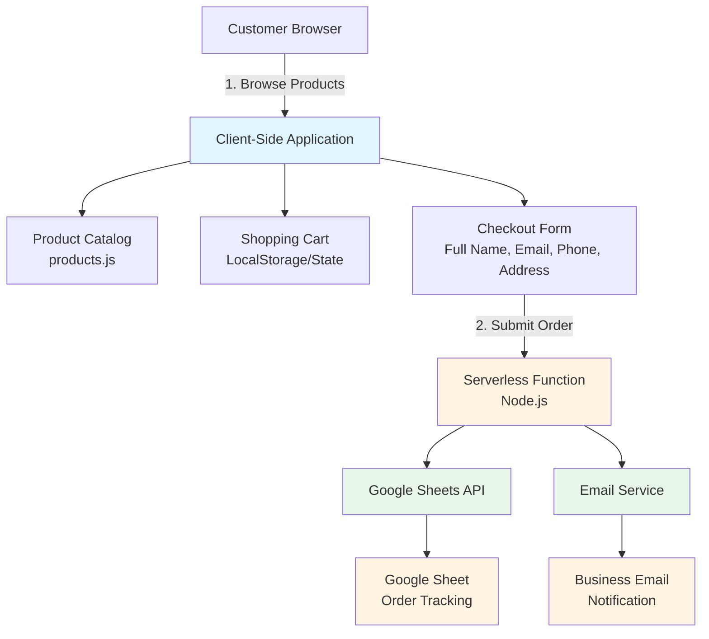
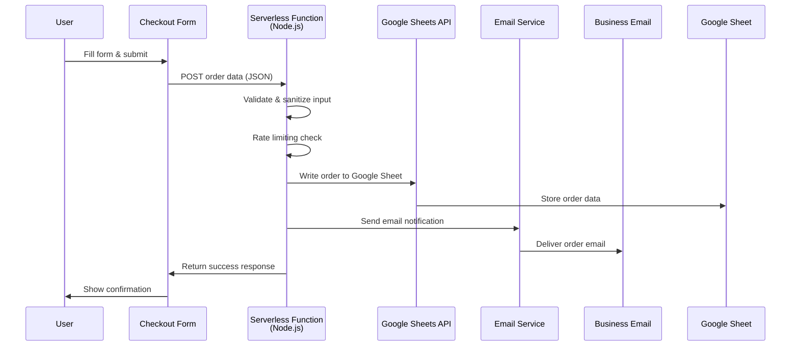

# Ordering System Architecture

## Overview

This document outlines the architecture for the All Day Treats ordering system. The system enables customers to build a cart, review their order, and submit order information through a checkout form. The architecture prioritizes **zero monthly costs**, **simplicity**, and **maintainability** while meeting the business's operational needs.

See also: [Product Requirements Document](../../PRD.md) | [Project README](../../README.md)

## System Architecture

### High-Level Flow

### Core Components

| Component                    | Status      | Responsibilities                                                                                     |
| ---------------------------- | ----------- | ---------------------------------------------------------------------------------------------------- |
| **Product Catalog**          | Implemented | Product definitions with pricing, images, categories                                                 |
| **Shopping Cart**            | New         | Client-side state management, add/remove items, quantity management, price calculations, persistence |
| **Checkout Form**            | New         | Customer information collection, order review/summary, order submission                              |
| **Order Submission Service** | New         | Format order data, send to storage backend, handle errors and retries                                |
| **Order Storage Backend**    | New         | Receives and stores order data, provides access to business owner                                    |

## Architecture: Serverless Function with Google Sheets + Email

**Security by Default:**

The serverless function approach provides **security by default** with complete control over the security layer:

1. **API Keys Never Exposed** - All sensitive credentials stay server-side
2. **Full Control Over Validation** - Custom validation rules, input sanitization, pattern detection
3. **Built-in Rate Limiting** - Prevent abuse and spam at the source
4. **Multiple Spam Prevention Layers** - Rate limiting, CAPTCHA, honeypot, pattern detection, IP blocking
5. **IP/Email Blocking** - Block known spam sources
6. **Request Logging** - Track and analyze suspicious activity for continuous improvement
7. **Error Handling** - Graceful failure without exposing system details

### Simplified Checkout Flow

**User Interface:**

1. Cart screen showing items, quantities, and price totals
2. Form fields: Full Name, Email Address, Phone Number, Delivery Address
3. Submit button

**Stack:**

- **Frontend:** Vanilla JavaScript (existing)
- **Cart State:** LocalStorage + in-memory state
- **Order Submission:** Node.js serverless function (Vercel/Netlify)
- **Storage:** Google Sheets API
- **Notifications:** Email via serverless function (SendGrid, Resend, or similar)
- **Cost:** $0/month (free tier)

**Data Flow:**

**Benefits of Single Serverless Function:**

- **Single point of control** - All logic in one place
- **Security** - API keys never exposed to client
- **Spam prevention** - Rate limiting, validation, CAPTCHA support
- **Reliability** - Error handling and retries
- **Cost effective** - Free tier covers typical usage
- **Easy tracking** - Google Sheets provides structured data
- **Notifications** - Email alerts for new orders

**Order Data Requirements:**

The order payload must include:

- Unique order identifier
- Timestamp
- Customer information (full name, email, phone, delivery address)
- Order items (product details, quantities, prices)
- Order totals (subtotal, estimated total)
- Optional order notes

**Serverless Function Responsibilities:**

1. **Input Validation** - Validate and sanitize all user input
2. **Spam Prevention** - Rate limiting, pattern detection, bot prevention
3. **Google Sheets Integration** - Store order data in structured format
4. **Email Notification** - Send order notification to business owner
5. **Error Handling** - Graceful error handling and logging

**Spam Prevention Strategies (Security by Default):**

1. **Rate Limiting (Primary Defense)**

   - Limit submissions per IP address: 3 orders per hour
   - Limit submissions per email address: 5 orders per day
   - Use in-memory cache (Vercel Edge Config) or Redis for tracking
   - Return clear error messages when limit exceeded
   - Track and log rate limit violations

2. **Input Validation & Sanitization**

   - Validate all required fields before processing
   - Sanitize all user input (prevent XSS, injection)
   - Reject obviously fake data (test@test.com, 123-456-7890)
   - Validate email format and domain (DNS lookup optional)
   - Check phone number format
   - Validate address format (basic checks)
   - Check for common spam patterns (repeated characters, gibberish)

3. **Honeypot Fields (Bot Detection)**

   - Hidden form field that bots will fill
   - Reject submissions with honeypot filled
   - Zero user impact (invisible to humans)
   - Catches most automated spam

4. **CAPTCHA (For Suspicious Activity)**

   - Google reCAPTCHA v3 (invisible, free)
   - Only trigger for low-score submissions
   - Can be added later if spam becomes an issue
   - Fallback to reCAPTCHA v2 if needed

5. **Pattern Detection**

   - Block known spam domains
   - Detect suspicious email patterns
   - Check for duplicate submissions (same order data)
   - Flag rapid-fire submissions

6. **IP & Email Blocking**

   - Maintain blocklist of known spam sources
   - Block repeated offenders
   - Log all blocked attempts

**Security Features:**

| Feature              | Implementation                                               |
| -------------------- | ------------------------------------------------------------ |
| **API Key Security** | Never exposed (server-side only)                             |
| **Rate Limiting**    | Full control (per IP and email)                              |
| **Input Validation** | Custom rules with sanitization                               |
| **Spam Detection**   | Multiple layers (rate limiting, honeypot, pattern detection) |
| **IP Blocking**      | Blocklist support for known spam sources                     |
| **Request Logging**  | Full logs for analysis and debugging                         |
| **Error Handling**   | Controlled responses without exposing system details         |

**Cost Breakdown:**

| Service               | Free Tier                 | Typical Usage             | Cost |
| --------------------- | ------------------------- | ------------------------- | ---- |
| **Vercel Serverless** | 100GB bandwidth/month     | ~1,000 orders/month       | $0   |
| **Netlify Functions** | 125,000 invocations/month | ~1,000 orders/month       | $0   |
| **Google Sheets API** | 100 requests/100 seconds  | Unlimited (within limits) | $0   |
| **SendGrid Email**    | 100 emails/day            | ~30 orders/month          | $0   |
| **Resend Email**      | 3,000 emails/month        | ~100 orders/month         | $0   |

**Total Monthly Cost: $0** (for typical small business usage)

**Configuration Requirements:**

The serverless function will require:

- Google Sheets API credentials
- Email service API credentials
- Business email address for notifications
- Rate limiting configuration (optional)

**Data Storage Structure:**

Orders will be stored in Google Sheets with columns for:

- Timestamp
- Order ID
- Customer information (name, email, phone, address)
- Order items
- Totals
- Notes

---

## Frontend Components

### Shopping Cart

**Purpose:** Allow customers to collect items before checkout

**Key Requirements:**

- Add/remove items
- Update quantities
- Calculate totals
- Persist cart state across sessions
- Display cart summary

### Checkout Form

**Purpose:** Collect customer information and submit order

**Key Requirements:**

- Display order summary
- Collect customer information (name, email, phone, address)
- Validate input before submission
- Submit order to serverless function
- Handle submission states (loading, success, error)

---

## Security Considerations

### Data Privacy

- **PII Handling:** Customer name, phone, address stored in emails/sheets
- **No Payment Data:** System does not handle payment information
- **GDPR/CCPA:** Consider privacy policy for data collection

### API Key Security

- All API keys must be stored server-side
- API keys must never be exposed to the client
- Environment variables required for configuration

### Input Validation

- Client-side validation for user experience
- Server-side validation required for security
- All user input must be sanitized before processing

---

## Performance Considerations

### Cart Persistence

- Cart state must persist across browser sessions
- Storage solution should be fast and reliable
- Must handle storage limitations gracefully

### Order Submission

- Submission must be non-blocking
- User feedback required during submission
- Error handling must not degrade user experience

### Bundle Size

- Minimize additional JavaScript dependencies
- Prefer native browser APIs where possible

---

## User Experience Flow

### Cart Flow

1. User browses products
2. User adds items to cart
3. Cart persists across page refreshes
4. User can view and modify cart contents
5. User proceeds to checkout

### Checkout Flow

1. User reviews order summary
2. User enters customer information
3. User submits order
4. System processes order (validates, stores, notifies)
5. User receives confirmation

### Error Handling

The system must handle:

- Network failures
- Validation errors
- Rate limiting
- Server errors

All errors should provide clear user feedback and fallback options.

---

## Technology Stack Summary

| Layer                | Technology                    | Status   | Notes                            |
| -------------------- | ----------------------------- | -------- | -------------------------------- |
| **Build Tool**       | Vite                          | Existing | See [README.md](../../README.md) |
| **Language**         | JavaScript                    | Existing | Vanilla JS, no framework         |
| **Styling**          | CSS with Custom Properties    | Existing | Tailwind optional                |
| **State Management** | Vanilla JS + localStorage     | New      | Client-side only                 |
| **Order Submission** | Serverless Function (Node.js) | New      | Vercel/Netlify free tier         |
| **Cart Storage**     | Browser localStorage          | New      | Key: `alldaytreats-cart`         |
| **Order Storage**    | Google Sheets                 | New      | Structured data storage          |
| **Email Service**    | SendGrid/Resend/etc           | New      | Free tier available              |

---

## Open Questions

1. **Order Volume:** How many orders per month are expected?
2. **Notification Preferences:** Email only, or SMS as well?
3. **Order Management:** Need for order status tracking (pending, fulfilled, etc.)?
4. **Team Access:** Will multiple people need to view orders?
5. **Data Retention:** How long should order data be kept?
6. **Backup Strategy:** Is email backup sufficient, or need additional backup?

---

---

## Related Documents

### Project Documentation

- [Product Requirements Document](../../PRD.md) - Business requirements and constraints
- [Project README](../../README.md) - Project overview and setup
- [Product Catalog](../../src/products.js) - Product data structure

### Architecture & Design

- [Ordering System Feature](./ordering-system-feature.md) - Feature overview and user stories
- [Component Specifications](./components/) - Individual component designs (to be created)

### Documentation Standards

- [Documentation Guidelines](../coding_with_vibes/README.md) - V.I.B.E.S. documentation methodology
- [Architecture Guidelines](../coding_with_vibes/15k_documentation_guidelines.md) - Architecture documentation standards
