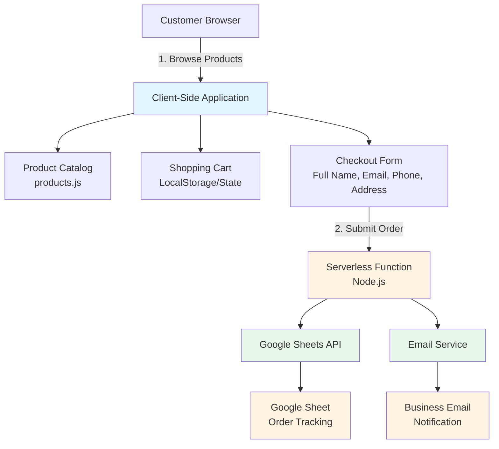
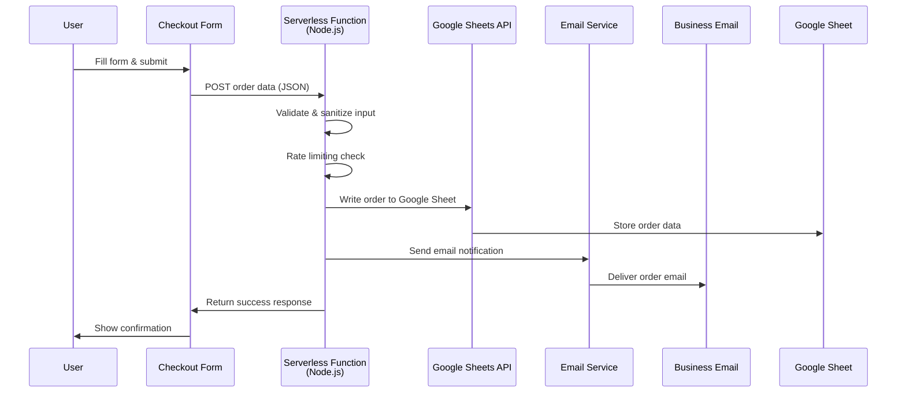
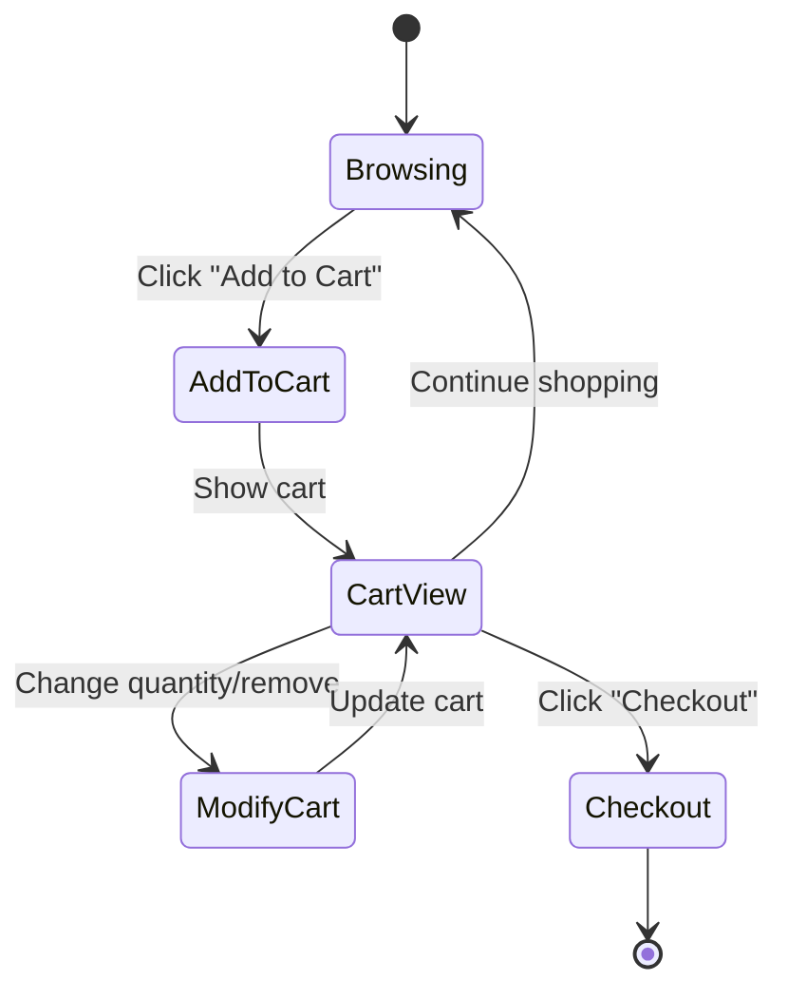
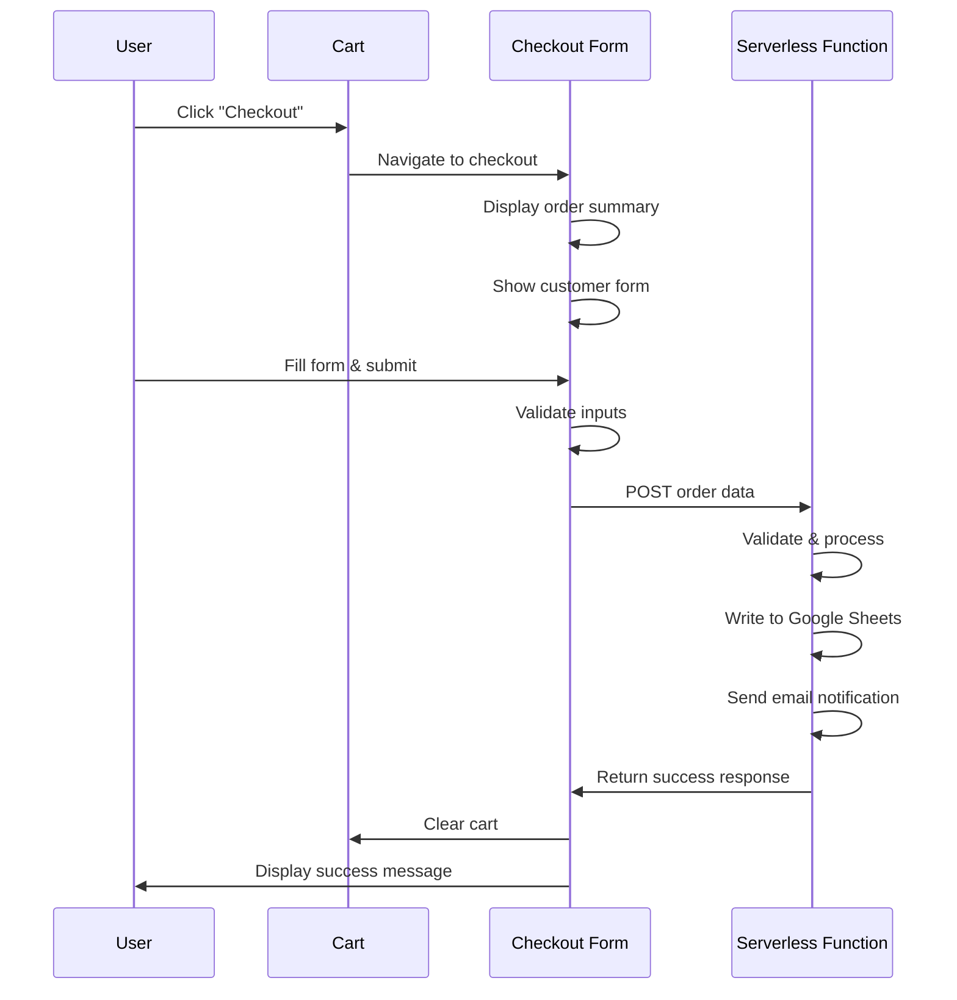

# Ordering System Architecture

## Overview

This document outlines the architecture for the All Day Treats ordering system. The system enables customers to build a cart, review their order, and submit order information through a checkout form. The architecture prioritizes **zero monthly costs**, **simplicity**, and **maintainability** while meeting the business's operational needs.

See also: [Product Requirements Document](../../PRD.md) | [Project README](../../README.md)

## System Architecture

### High-Level Flow



### Core Components

| Component                    | Status              | Location          | Responsibilities                                                                                                  |
| ---------------------------- | ------------------- | ----------------- | ----------------------------------------------------------------------------------------------------------------- |
| **Product Catalog**          | Implemented         | `src/products.js` | Product definitions with pricing, images, categories                                                              |
| **Shopping Cart**            | New                 | `src/cart/`       | Client-side state management, add/remove items, quantity management, price calculations, localStorage persistence |
| **Checkout Form**            | New                 | `src/checkout/`   | Customer information collection, order review/summary, order submission                                           |
| **Order Submission Service** | New                 | `src/services/`   | Format order data, send to storage backend, handle errors and retries                                             |
| **Order Storage Backend**    | Serverless Function | External service  | Receives and stores order data, provides access to business owner                                                 |

## Architecture: Serverless Function with Google Sheets + Email

**Security by Default:**

The serverless function approach provides **security by default** with complete control over the security layer:

1. **API Keys Never Exposed** - All sensitive credentials stay server-side
2. **Full Control Over Validation** - Custom validation rules, input sanitization, pattern detection
3. **Built-in Rate Limiting** - Prevent abuse and spam at the source
4. **Multiple Spam Prevention Layers** - Rate limiting, CAPTCHA, honeypot, pattern detection, IP blocking
5. **IP/Email Blocking** - Block known spam sources
6. **Request Logging** - Track and analyze suspicious activity for continuous improvement
7. **Error Handling** - Graceful failure without exposing system details

### Simplified Checkout Flow

**User Interface:**

1. Cart screen showing items, quantities, and price totals
2. Form fields: Full Name, Email Address, Phone Number, Delivery Address
3. Submit button

**Stack:**

- **Frontend:** Vanilla JavaScript (existing)
- **Cart State:** LocalStorage + in-memory state
- **Order Submission:** Node.js serverless function (Vercel/Netlify)
- **Storage:** Google Sheets API
- **Notifications:** Email via serverless function (SendGrid, Resend, or similar)
- **Cost:** $0/month (free tier)

**Data Flow:**



**Benefits of Single Serverless Function:**

- **Single point of control** - All logic in one place
- **Security** - API keys never exposed to client
- **Spam prevention** - Rate limiting, validation, CAPTCHA support
- **Reliability** - Error handling and retries
- **Cost effective** - Free tier covers typical usage
- **Easy tracking** - Google Sheets provides structured data
- **Notifications** - Email alerts for new orders

**Order Data Structure:**

```javascript
/**
 * Order payload sent from checkout form to serverless function
 * @typedef {Object} Order
 * @property {string} id - Generated client-side (UUID or timestamp-based)
 * @property {string} timestamp - ISO 8601 format
 * @property {Object} customer
 * @property {string} customer.fullName - Full name
 * @property {string} customer.email - Email address
 * @property {string} customer.phone - Phone number
 * @property {string} customer.deliveryAddress - Delivery address
 * @property {Array<OrderItem>} items
 * @property {number} subtotal
 * @property {number} estimatedTotal - May vary based on customization
 * @property {string} [notes] - Optional order notes
 */

/**
 * @typedef {Object} OrderItem
 * @property {string} productId
 * @property {string} productName
 * @property {number} quantity
 * @property {number} pricePerUnit
 * @property {number} totalPrice
 * @property {string[]} [customizations] - Optional customizations
 */
```

**Serverless Function Responsibilities:**

1. **Input Validation**

   - Validate all required fields
   - Sanitize user input
   - Check email format
   - Verify phone number format

2. **Spam Prevention**

   - Rate limiting (per IP or email)
   - Optional: CAPTCHA verification
   - Check for suspicious patterns
   - Block known spam domains

3. **Google Sheets Integration**

   - Authenticate with Google Sheets API
   - Append order row to spreadsheet
   - Include: timestamp, customer info, items, totals

4. **Email Notification**

   - Format order data for email
   - Send to business owner
   - Include order summary and customer details

5. **Error Handling**
   - Log errors for debugging
   - Return appropriate error messages
   - Retry failed operations

**Spam Prevention Strategies (Security by Default):**

1. **Rate Limiting (Primary Defense)**

   - Limit submissions per IP address: 3 orders per hour
   - Limit submissions per email address: 5 orders per day
   - Use in-memory cache (Vercel Edge Config) or Redis for tracking
   - Return clear error messages when limit exceeded
   - Track and log rate limit violations

2. **Input Validation & Sanitization**

   - Validate all required fields before processing
   - Sanitize all user input (prevent XSS, injection)
   - Reject obviously fake data (test@test.com, 123-456-7890)
   - Validate email format and domain (DNS lookup optional)
   - Check phone number format
   - Validate address format (basic checks)
   - Check for common spam patterns (repeated characters, gibberish)

3. **Honeypot Fields (Bot Detection)**

   - Hidden form field that bots will fill
   - Reject submissions with honeypot filled
   - Zero user impact (invisible to humans)
   - Catches most automated spam

4. **CAPTCHA (For Suspicious Activity)**

   - Google reCAPTCHA v3 (invisible, free)
   - Only trigger for low-score submissions
   - Can be added later if spam becomes an issue
   - Fallback to reCAPTCHA v2 if needed

5. **Pattern Detection**

   - Block known spam domains
   - Detect suspicious email patterns
   - Check for duplicate submissions (same order data)
   - Flag rapid-fire submissions

6. **IP & Email Blocking**

   - Maintain blocklist of known spam sources
   - Block repeated offenders
   - Log all blocked attempts

**Security Features:**

| Feature              | Implementation                                               |
| -------------------- | ------------------------------------------------------------ |
| **API Key Security** | Never exposed (server-side only)                             |
| **Rate Limiting**    | Full control (per IP and email)                              |
| **Input Validation** | Custom rules with sanitization                               |
| **Spam Detection**   | Multiple layers (rate limiting, honeypot, pattern detection) |
| **IP Blocking**      | Blocklist support for known spam sources                     |
| **Request Logging**  | Full logs for analysis and debugging                         |
| **Error Handling**   | Controlled responses without exposing system details         |

**Cost Breakdown:**

| Service               | Free Tier                 | Typical Usage             | Cost |
| --------------------- | ------------------------- | ------------------------- | ---- |
| **Vercel Serverless** | 100GB bandwidth/month     | ~1,000 orders/month       | $0   |
| **Netlify Functions** | 125,000 invocations/month | ~1,000 orders/month       | $0   |
| **Google Sheets API** | 100 requests/100 seconds  | Unlimited (within limits) | $0   |
| **SendGrid Email**    | 100 emails/day            | ~30 orders/month          | $0   |
| **Resend Email**      | 3,000 emails/month        | ~100 orders/month         | $0   |

**Total Monthly Cost: $0** (for typical small business usage)

### Implementation Details

**Serverless Function Example Structure:**

```javascript
// api/submit-order.js (Vercel/Netlify serverless function)
export default async function handler(req, res) {
	// Only allow POST requests
	if (req.method !== "POST") {
		return res.status(405).json({ error: "Method not allowed" });
	}

	try {
		// 1. Validate input
		const order = validateOrder(req.body);

		// 2. Rate limiting check
		await checkRateLimit(req);

		// 3. Write to Google Sheets
		await appendToGoogleSheet(order);

		// 4. Send email notification
		await sendOrderEmail(order);

		// 5. Return success
		return res.status(200).json({
			success: true,
			orderId: order.id,
		});
	} catch (error) {
		// Error handling
		console.error("Order submission error:", error);
		return res.status(500).json({
			error: "Failed to submit order",
		});
	}
}
```

**Required Environment Variables:**

- `GOOGLE_SHEETS_API_KEY` - Google Sheets API key
- `GOOGLE_SHEET_ID` - ID of the target spreadsheet
- `EMAIL_API_KEY` - Email service API key (SendGrid, Resend, etc.)
- `BUSINESS_EMAIL` - Email address to receive notifications
- `RATE_LIMIT_SECRET` - Secret for rate limiting (optional)

**Google Sheets Structure:**

| Timestamp        | Order ID | Full Name | Email            | Phone    | Address     | Items      | Subtotal | Total  | Notes          |
| ---------------- | -------- | --------- | ---------------- | -------- | ----------- | ---------- | -------- | ------ | -------------- |
| 2026-01-15 10:30 | abc123   | John Doe  | john@example.com | 555-1234 | 123 Main St | JSON array | $45.00   | $50.00 | Birthday party |

---

## Component Design

### Shopping Cart Component

**Responsibilities:**

- Manage cart state (add, remove, update quantities)
- Calculate totals
- Persist to localStorage
- Display cart summary/badge

**State Management:**

```javascript
/**
 * @typedef {Object} CartItem
 * @property {string} productId
 * @property {number} quantity
 * @property {Object} selectedPriceOption
 * @property {number} selectedPriceOption.count
 * @property {number} selectedPriceOption.price
 * @property {string[]} customizations
 */

/**
 * @typedef {Object} CartState
 * @property {CartItem[]} items
 * @property {string} lastUpdated - ISO 8601 timestamp
 */
```

**Storage:** localStorage with key `alldaytreats-cart`

### Checkout Form Component

**Responsibilities:**

- Display order summary (items, quantities, price totals)
- Collect customer information
- Validate form inputs
- Submit order to serverless function
- Show confirmation/loading states

**Form Fields:**

- Full Name (required, text)
- Email Address (required, email, validation)
- Phone Number (required, tel, validation)
- Delivery Address (required, textarea)
- Order Notes (optional, textarea)

**Validation:**

- Client-side validation before submission
- Email format validation
- Phone number format validation
- Required field checks
- Display inline error messages

### Order Submission Service

**Responsibilities:**

- Format order data as JSON
- Send POST request to serverless function endpoint
- Handle errors and retries
- Provide user feedback

**Error Handling:**

- Network failures: Retry with exponential backoff (max 2 retries)
- Validation errors: Show user-friendly messages from server
- Rate limiting: Inform user to try again later
- Server errors: Show contact information as fallback

---

## Security Considerations

### Data Privacy

- **PII Handling:** Customer name, phone, address stored in emails/sheets
- **No Payment Data:** System does not handle payment information
- **GDPR/CCPA:** Consider privacy policy for data collection

### API Key Security

- **Google Sheets API:** API key stored server-side in environment variables
- **Email Service API:** API key stored server-side in environment variables
- **Environment Variables:** Use `.env` for development, build-time injection for production
- **Never Exposed:** All API keys remain on server, never sent to client

### Input Validation

- **Client-Side:** Prevent malicious input, validate formats (UX improvement)
- **Server-Side:** Full validation and sanitization (security requirement)
- **Sanitization:** Escape HTML in user inputs, prevent injection attacks

---

## Performance Considerations

### Cart Persistence

- **localStorage:** Fast, synchronous, 5-10MB limit
- **Session Storage:** Alternative if cart should not persist across sessions
- **IndexedDB:** Overkill for cart data

### Order Submission

- **Async/Await:** Non-blocking submission
- **Loading States:** Show progress during submission
- **Optimistic UI:** Update UI immediately, handle errors gracefully

### Bundle Size

- **No Client-Side SDKs:** Uses native `fetch` API
- **Total Impact:** Zero additional bundle size

---

## User Experience Flow

### Cart Flow



**Steps:**

1. User browses products
2. Clicks "Add to Cart" on product
3. Cart icon shows item count
4. User can view cart (slide-out or page)
5. User can modify quantities or remove items
6. Cart persists across page refreshes

### Checkout Flow



**Steps:**

1. User clicks "Checkout" from cart
2. Checkout page shows:
   - Order summary (items, quantities, prices)
   - Customer information form
   - Estimated total
3. User fills form and submits
4. Loading state shown
5. Success confirmation displayed
6. Cart cleared
7. Option to return to menu

### Error Handling

| Error Type           | User Message                                                             | Action                      |
| -------------------- | ------------------------------------------------------------------------ | --------------------------- |
| **Network Error**    | "Unable to submit order. Please try again or contact us directly."       | Retry button + contact info |
| **Validation Error** | Inline field errors                                                      | Highlight invalid fields    |
| **Service Limit**    | "We're experiencing high volume. Please contact us directly at [email]." | Show contact information    |

---

## Technology Stack Summary

| Layer                | Technology                    | Status   | Notes                            |
| -------------------- | ----------------------------- | -------- | -------------------------------- |
| **Build Tool**       | Vite                          | Existing | See [README.md](../../README.md) |
| **Language**         | JavaScript                    | Existing | Vanilla JS, no framework         |
| **Styling**          | CSS with Custom Properties    | Existing | Tailwind optional                |
| **State Management** | Vanilla JS + localStorage     | New      | Client-side only                 |
| **Order Submission** | Serverless Function (Node.js) | New      | Vercel/Netlify free tier         |
| **Cart Storage**     | Browser localStorage          | New      | Key: `alldaytreats-cart`         |
| **Order Storage**    | Google Sheets                 | New      | Structured data storage          |
| **Email Service**    | SendGrid/Resend/etc           | New      | Free tier available              |

---

## Open Questions

1. **Order Volume:** How many orders per month are expected?
2. **Notification Preferences:** Email only, or SMS as well?
3. **Order Management:** Need for order status tracking (pending, fulfilled, etc.)?
4. **Team Access:** Will multiple people need to view orders?
5. **Data Retention:** How long should order data be kept?
6. **Backup Strategy:** Is email backup sufficient, or need additional backup?

---

## Next Steps

1. **5k Documentation:** Break down into specific implementation tasks
2. **Setup:** Configure serverless function environment (Vercel/Netlify)
3. **Google Sheets Setup:** Create spreadsheet and configure API access
4. **Email Service Setup:** Configure email service (SendGrid/Resend)
5. **Prototype:** Build MVP with serverless function
6. **Test:** Validate with sample orders
7. **Iterate:** Add enhancements based on usage

---

## Related Documents

### Project Documentation

- [Product Requirements Document](../../PRD.md) - Business requirements and constraints
- [Project README](../../README.md) - Project overview and setup
- [Product Catalog](../../src/products.js) - Product data structure

### Architecture & Design

- [Implementation Plan](./ordering-system-5k.md) - Detailed implementation tasks (to be created)
- [Component Specifications](./components/) - Individual component designs (to be created)

### Documentation Standards

- [Documentation Guidelines](../coding_with_vibes/README.md) - V.I.B.E.S. documentation methodology
- [Architecture Guidelines](../coding_with_vibes/15k_documentation_guidelines.md) - Architecture documentation standards
