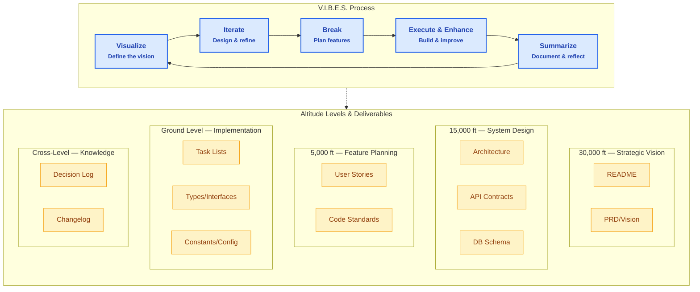

# Coding with V.I.B.E.S.

A comprehensive software development methodology that bridges the gap between high-level vision and ground-level implementation through structured, layered documentation practices. **This is a working example of how to effectively collaborate with AI coding assistants** in real software development projects.

**V.I.B.E.S.** stands for:

- **Visualize** (30,000ft) — Define the vision and strategic direction
- **Iterate** (15,000ft) — Design system architecture and iterate on solutions
- **Break** (5,000ft) — Break down features into actionable user stories
- **Execute & Enhance** (Ground Level) — Build, implement, and continuously improve
- **Summarize** (Cross-Level) — Document decisions and reflect on progress

## Purpose

This framework provides a **systematic approach to software project documentation** specifically designed to work seamlessly with AI coding assistants. Whether you're planning a new feature, breaking down complex requirements, or onboarding new team members, this system helps maintain alignment from vision to code while maximizing the effectiveness of human-AI collaboration.

**Key Benefits:**

- **AI-Optimized**: Structured formats that AI assistants can easily understand and maintain
- **Developer-Focused**: Practical guidance for real development workflows
- **Battle-Tested**: Actively used in production software development
- **Tool-Agnostic**: Works with any development stack or project management tools

## What's Included

This documentation framework consists of **guidelines, standards, and templates** organized into distinct altitude levels:

### The V.I.B.E.S. Methodology

| V.I.B.E.S. Step       | Altitude         | Focus                  | Purpose                                                                   | Key Documents                                        |
| --------------------- | ---------------- | ---------------------- | ------------------------------------------------------------------------- | ---------------------------------------------------- |
| **Visualize**         | **30,000ft**     | Vision & Strategy      | Why does this project exist? What problem are we solving?                 | Project vision, requirements, scope                  |
| **Iterate**           | **15,000ft**     | Architecture & Design  | How will we build this? What are the system components?                   | Architecture diagrams, API contracts, tech decisions |
| **Break**             | **5,000ft**      | Features & Standards   | What specific features are we building? How should code be written?       | User stories, coding standards, feature specs        |
| **Execute & Enhance** | **Ground Level** | Tasks & Implementation | What exact steps need to be taken? What are the specific constants/types? | Task breakdowns, constants, interfaces               |
| **Summarize**         | **Cross-Level**  | Knowledge & Decisions  | What did we learn? What decisions did we make? How do we track progress?  | Decision logs, changelogs, retrospectives            |

### Supporting Documentation

- **Summarizing Documentation**: Decision logs, changelogs, project summaries
- **Review Standards**: Checklists and validation criteria for each documentation type
- **YAML Schemas**: Structured metadata for consistent tracking

## Quick Start

### 1. Choose Your Starting Point

**New Project?** Start with [30,000ft Documentation Guidelines](30k_documentation_guidelines.md)

- Define your project vision and requirements
- Establish scope and success criteria

**Existing Project?** Start with [15,000ft Documentation Guidelines](15k_documentation_guidelines.md)

- Document current architecture
- Establish design patterns and workflows

**Feature Development?** Start with [5,000ft Documentation Guidelines](5k_documentation_guidelines.md)

- Write user stories with acceptance criteria
- Define coding standards

**Implementation Phase?** Start with [Ground Level Documentation Guidelines](ground_level_documentation_guidelines.md)

- Break features into specific tasks
- Define constants, types, and interfaces

### 2. Follow the V.I.B.E.S. Flow

```
Visualize → Iterate → Break → Execute & Enhance → Summarize
    ↓         ↓        ↓            ↓              ↓
  Vision → Architecture → Features → Implementation → Knowledge
 (30k ft)   (15k ft)     (5k ft)    (Ground)       (Cross-Level)
```

### 3. Use the Templates

Each guideline document includes **copy-paste prompts** for creating documentation with AI assistants or guiding manual creation.

## Documentation Guide

### Visualize — Vision & Strategy (30,000ft)

**When to use**: Project kickoff, stakeholder alignment, onboarding

- [30,000ft Documentation Guidelines](30k_documentation_guidelines.md)
- Creates: README, Project Requirements Document (PRD), Vision statements

### Iterate — Architecture & Design (15,000ft)

**When to use**: System design, technical planning, parallel development coordination

- [15,000ft Documentation Guidelines](15k_documentation_guidelines.md)
- Creates: Architecture diagrams, API contracts, technology decisions

### Break — Features & Standards (5,000ft)

**When to use**: Sprint planning, feature development, code consistency

- [5,000ft Documentation Guidelines](5k_documentation_guidelines.md)
- [User Story Standards](user-story-standards.md)
- [User Story Impact/Risk Scoring Guide](user-story-impact-risk-scoring-guide.md)
- [User Story Splitting Guide](user-story-splitting-guide.md)
- Creates: User stories, acceptance criteria, coding standards

### Execute & Enhance — Tasks & Implementation (Ground Level)

**When to use**: Sprint execution, detailed development work, implementation clarity

- [Ground Level Documentation Guidelines](ground_level_documentation_guidelines.md)
- [Task Breakdown Standards](task_breakdown_standards.md)
- [Task YAML Schema](task_breakdown_yaml_schema.md)
- [Task Review Checklist](task_breakdown_review_checklist.md)
- Creates: Task breakdowns, constants files, type definitions

### Summarize — Project Evolution & Knowledge Capture

**When to use**: Decision tracking, progress reporting, historical context

- [Summarizing Documentation Guidelines](summarizing_documentation_guidelines.md)
- Creates: Decision logs, changelogs, project summaries

## Workflow Integration

### V.I.B.E.S. Cycle Implementation

**Visualize** → Define project purpose, scope, and strategic vision
**Iterate** → Design system structure, architecture, and technical approach
**Break** → Decompose features into actionable user stories and standards
**Execute & Enhance** → Build incrementally while continuously improving
**Summarize** → Capture learnings, decisions, and progress for future cycles

### Development Phase

1. Use **task breakdowns** to guide daily work (Execute & Enhance)
2. Update **status tracking** as work progresses
3. Document **decisions** and **changes** using Summarize practices
4. Maintain **alignment** across all V.I.B.E.S. levels

### Review Phase

- Use provided **checklists** to validate documentation quality
- Ensure **traceability** between V.I.B.E.S. levels (YAML metadata helps)
- Keep documentation **current** as project evolves through the cycle

## Key Features

### Structured Metadata

- **YAML front matter** in all documents ensures consistency
- **Linking systems** maintain traceability between documents
- **Status tracking** provides visibility into progress

### Impact/Risk Scoring

- **Standardized scoring** (1, 2, 3, 5, 8, 13, 21) for user stories
- **Automatic splitting rules** prevent stories from becoming too large
- **Risk assessment** captures both technical and business factors

### AI-Human Collaboration Optimized

- **Copy-paste prompts** for generating documentation with AI coding assistants
- **Structured formats** that AI can easily parse, understand, and maintain
- **Clear context boundaries** that help AI assistants provide better suggestions
- **Traceability systems** that allow AI to understand project relationships
- **Incremental complexity** that matches how AI assistants work best

## V.I.B.E.S. Visual Overview

The following diagram shows how the V.I.B.E.S. methodology creates a continuous cycle of improvement, with each step producing specific documentation artifacts:



## Working with AI Coding Assistants

This framework is specifically designed to maximize the effectiveness of AI-human collaboration in software development.

### Why This Structure Works with AI

**Incremental Context Building**: AI assistants work best when given clear, bounded context. The altitude levels provide natural context boundaries that prevent overwhelming AI with too much information while ensuring sufficient detail for accurate assistance.

**Structured Prompts**: Each guideline document includes copy-paste prompts specifically designed for AI assistants. These prompts provide the right amount of context and constraints to generate useful documentation.

**Linked Information**: The YAML metadata and linking systems help AI assistants understand relationships between documents, leading to more coherent suggestions across the entire project.

### Best Practices for AI Collaboration

1. **Start with Purpose** (30k): Give your AI assistant the project vision before diving into technical details
2. **Provide Architecture Context** (15k): Share system design documents so AI understands the bigger picture
3. **Use Structured Prompts**: Copy the provided prompts from guideline documents for consistent results
4. **Maintain Links**: Keep YAML metadata updated so AI can trace relationships between stories, tasks, and decisions
5. **Iterate Documentation**: Use AI to help keep documentation current as your project evolves

### Example AI Collaboration Workflow

```
Developer: [Shares 30k vision doc] "Help me break down this feature into user stories"
AI: [Creates 5k user stories following the standards, linking back to vision]

Developer: [Shares user story] "Create tasks for this story"
AI: [Creates ground-level tasks with proper YAML metadata and checklists]

Developer: [After implementation] "Help me update the decision log"
AI: [Creates summarizing documentation capturing what was built and why]
```

## File Organization

```
project-docs/
├── vision/           # 30k documents
├── architecture/     # 15k documents
├── features/         # 5k user stories
├── tasks/           # Ground level breakdowns
└── decisions/       # Summarizing documents
```

## FAQ

**Q: Do I need to create all documentation types?**
A: No. Start with what's most valuable for your current need. The framework is designed to be modular.

**Q: How is this different from regular Agile documentation?**
A: This framework adds AI-optimized structure and prompts to standard practices. The YAML metadata and linking systems make it much easier for AI assistants to understand and contribute to your project.

**Q: Can this work with my existing tools (Jira, GitHub, etc.)?**
A: Yes. The framework is tool-agnostic. The YAML metadata can be exported to most project management tools, and the structured approach complements existing Agile/Scrum practices.

**Q: What if my project is small?**
A: For small projects, focus on 5k (user stories) and ground level (tasks). The AI collaboration benefits are still valuable even without the full altitude stack.

**Q: How do I get my team to adopt this?**
A: Start small. Pick one feature and work through it with the framework, demonstrating the AI collaboration benefits. The structured prompts often win teams over quickly.

**Q: Does this replace my current development process?**
A: No, it enhances it. This framework provides better structure for documentation you're likely already creating, making it more useful for both humans and AI assistants.

## Contributing

This documentation framework is designed to evolve. As you use it:

1. **Track what works** and what doesn't
2. **Propose improvements** to templates and guidelines
3. **Share examples** of successful documentation
4. **Report gaps** or unclear guidance

## Getting Help

If you have questions about:

- **Which documentation level to use** → Start with your immediate need and work outward
- **Getting AI assistants to generate better documentation** → Use the copy-paste prompts in each guideline document
- **Integrating with existing development workflows** → Focus on the YAML metadata and status tracking systems
- **Training team members on AI collaboration** → Start with one feature and demonstrate the structured prompt approach
- **Scaling for larger teams** → Emphasize the linking systems and review checklists

### Common Implementation Patterns

**Solo Developer**: Focus on 5k stories and ground tasks, use AI for rapid documentation generation
**Small Team (2-5)**: Add 15k architecture docs for coordination, use shared YAML standards
**Larger Team (5+)**: Full altitude stack with emphasis on linking and review processes

---

_This framework is designed to work with both human teams and AI assistants, providing structure without bureaucracy and clarity without excessive overhead._
