# Coding with V.I.B.E.S. — Visual Overview

**Part of:** [Coding with V.I.B.E.S.](README.md)

**Navigation:** [V.I.B.E.S. Home](README.md) | [30k Guidelines](30k_documentation_guidelines.md) | [15k Guidelines](15k_documentation_guidelines.md) | [5k Guidelines](5k_documentation_guidelines.md) | [Ground Guidelines](ground_level_documentation_guidelines.md)

Below are Mermaid diagrams you can paste into your docs, slides (via Marp/Reveal/Obsidian/Notion), or GitHub markdown renderers that support Mermaid.

---

## 1) Loop + Artifacts (VIBES mapped to altitude deliverables)

```mermaid
flowchart TD
  classDef vibes fill:#dbeafe,stroke:#2563eb,stroke-width:2px,color:#1e40af,font-weight:bold;
  classDef altitude fill:#f0f9ff,stroke:#0ea5e9,stroke-width:1px,color:#0c4a6e;
  classDef doc fill:#fef3c7,stroke:#f59e0b,stroke-width:1px,color:#92400e;

  %% VIBES Process (Clean circular flow)
  subgraph PROCESS["🔄 V.I.B.E.S. Process"]
    V["🎯 Visualize<br/><small>Define the vision</small>"]:::vibes
    I["🔄 Iterate<br/><small>Design & refine</small>"]:::vibes
    B["📋 Break<br/><small>Plan features</small>"]:::vibes
    E["⚡ Execute & Enhance<br/><small>Build & improve</small>"]:::vibes
    S["📊 Summarize<br/><small>Document & reflect</small>"]:::vibes

    V --> I --> B --> E --> S --> V
  end

  %% Altitude Levels (Clean vertical stack)
  subgraph ALTITUDES["📏 Altitude Levels & Deliverables"]
    direction TB

    subgraph A30["🌍 30,000 ft — Strategic Vision"]
      README["📖 README"]:::doc
      PRD["📋 PRD/Vision"]:::doc
    end

    subgraph A15["🏗️ 15,000 ft — System Design"]
      ARCH["🏛️ Architecture"]:::doc
      API["🔌 API Contracts"]:::doc
      SCHEMA["🗄️ DB Schema"]:::doc
    end

    subgraph A5["📝 5,000 ft — Feature Planning"]
      STORY["👤 User Stories"]:::doc
      LINT["✨ Code Standards"]:::doc
    end

    subgraph AG["⚙️ Ground Level — Implementation"]
      TASKS["✅ Task Lists"]:::doc
      TYPES["🏷️ Types/Interfaces"]:::doc
      CONSTS["⚙️ Constants/Config"]:::doc
    end

    subgraph ACROSS["📚 Cross-Level — Knowledge"]
      ADR["🤔 Decision Log"]:::doc
      CHANGE["📈 Changelog"]:::doc
    end
  end

  %% Simple mapping (less visual noise)
  PROCESS -.-> ALTITUDES
```

---

## 2) Hierarchy Pyramid (altitudes with VIBES tags)

```mermaid
mindmap
  root((Coding with V.I.B.E.S.))
    ::icon(fa fa-diagram-project)
    30k["30,000 ft — **Visualize**"]
      - README / Project Overview
      - PRD / Vision / True North
    15k["15,000 ft — **Iterate**"]
      - System Architecture Overview
      - API Plan / Contracts
      - Database Schema
    5k["5,000 ft — **Break**"]
      - Feature User Stories + AC
      - Lint/Formatting Rules
    Ground["Ground Level — **Execute & Enhance**"]
      - Task Breakdowns (markdown checklists)
      - Types/Interfaces
      - Constants/Config
    Cross["Cross-level — **Summarize**"]
      - Decision Log / ADR
      - Changelog / Weekly Summary
```

---

## 3) Swimlanes Matrix (VIBES x Altitude mapping)

---

### Notes

- These are **copy‑paste ready** Mermaid blocks.
- For slides, consider one diagram per slide, then finish with the matrix.
- If you want static assets, I can export PNG/PDF versions from these.

---

## Related V.I.B.E.S. Documents

- **Main Hub:** [Coding with V.I.B.E.S.](README.md)
- **All Guidelines:** [30k](30k_documentation_guidelines.md) | [15k](15k_documentation_guidelines.md) | [5k](5k_documentation_guidelines.md) | [Ground](ground_level_documentation_guidelines.md) | [Summarize](summarizing_documentation_guidelines.md)
- **Standards:** [User Stories](user-story-standards.md) | [Task Breakdown](task_breakdown_standards.md)
